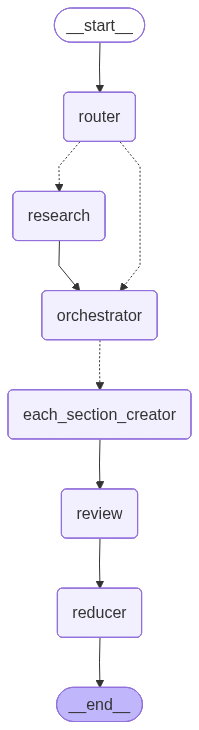
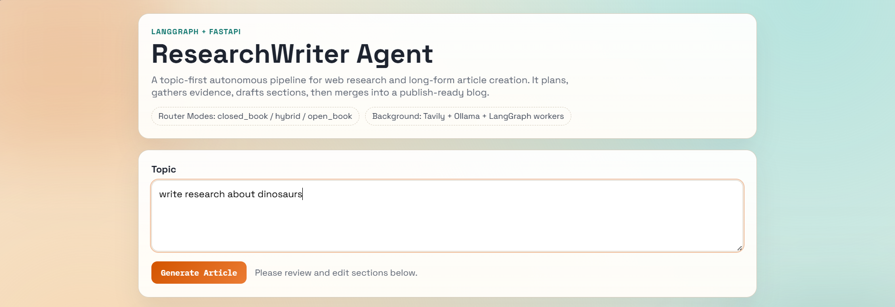
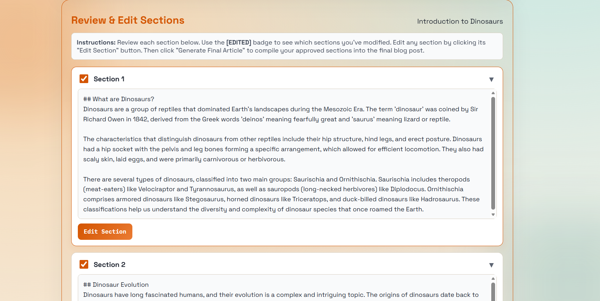
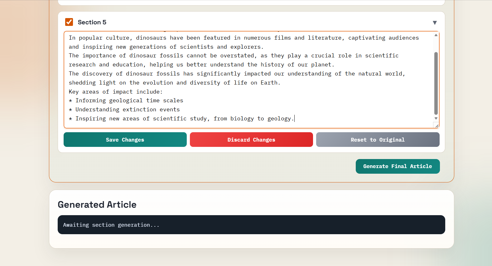
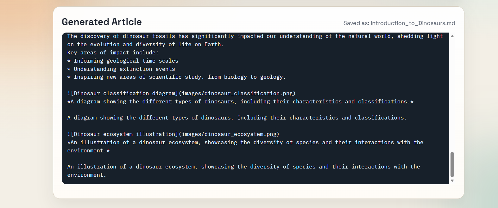

# ResearchWriter Agent – Autonomous AI Blog Generation System with Images

An end-to-end **agentic AI pipeline** built using **LangGraph + FastAPI**, designed to transform a simple topic into a structured, high-quality blog post through **multi-agent orchestration, real-time research, human-in-the-loop validation and image generation**.

> A full pipeline with planning, parallel execution, review, synthesis, and **dynamic AI image generation**.

---

## Architecture & Workflow

The system is implemented as a **LangGraph DAG-based agent pipeline**:

1. **Router**
   - Determines if web research is required

2. **Research Node**
   - Fetches external knowledge using Tavily

3. **Orchestrator**
   - Plans blog structure and sections

4. **Each Section Creator (Worker) Nodes (Parallel Execution)**
   - Generates each section independently

5. **Review Node (HITL)**
   - Pauses execution for user validation/editing

6. **Reducer Node with Image Generation**
   - Merges approved sections, decides optimal image placements, generates **context-aware images**, and produces the final polished output

---

## Demo & Workflow

### Agent Architecture
<p align="center">
  
</p>

> Multi-stage pipeline with routing, research, orchestration, parallel generation, and reduction with image generation.

---

### Topic Input & Generation
<p align="center">
  
</p>

> User provides a topic → system plans and initiates structured content generation.

---

### Section-wise Generation & Editing (Human-in-the-loop)
<p align="center">
  
</p>

> Each section is independently generated and can be reviewed and edited before finalization.

---

### Editing Controls
<p align="center">
  
</p>

> Fine-grained control with save, discard, and reset — enabling high-quality output.

---

### Final Compiled Article
<p align="center">
  
</p>

> Approved sections are merged into a structured markdown blog ready for publishing.

---

## Key Features

- **Agentic Multi-Step Pipeline**
  - Router → Research → Orchestrator → Parallel Writers → Review → Reducer
  - Moves beyond linear LLM calls into structured workflows

- **Parallel Section Generation**
  - Fan-out execution for faster content generation

- **Human-in-the-Loop (HITL) Validation**
  - User reviews and edits intermediate outputs before final compilation

- **Live Web Research**
  - Uses Tavily to fetch real-time, relevant context

- **Dynamic AI Image Generation & Placement**
  - Unlike standard text generators, this pipeline **automatically plans, prompts, and generates** highly context-aware images to accompany specific sections of the blog.
  - Dynamically decides *where* an image brings the most value and *what* the visual should represent, seamlessly weaving the generated assets into the final Markdown output.

- **Structured Output Generation**
  - Section-wise generation ensures coherence and control

- **Production-Oriented Design**
  - FastAPI backend + frontend UI
  - Modular LangGraph nodes
  - Scalable architecture

---

## Tech Stack

- **Agent Framework**: LangGraph, LangChain  
- **Backend**: FastAPI, Uvicorn  
- **LLM Inference**: Groq (Llama-3.3-70B)  
- **Image Generation**: NVIDIA API integration
- **Search Tool**: Tavily  
- **Frontend**: HTML, CSS, JavaScript  
- **Orchestration Pattern**: DAG-based multi-agent pipeline  

---

## Getting Started

### Prerequisites

- Python 3.10+
- Groq API Key
- Tavily API Key
- NVIDIA API Key

### Environment Setup

Create `.env` file:

```env
GROQ_API_KEY=your_key
TAVILY_API_KEY=your_key
NVIDIA_API_KEY=your_key
```

---
## Run the app after cloning in terminal

pip install -r requirements.txt

python -m uvicorn main:app --reload

open http://127.0.0.1:8000/

---
## 📂 Project Structure

blog_agent/
├── agent/
│   ├── nodes.py          # Agent nodes (router, researcher, etc.)
│   ├── state.py          # Graph state
│   ├── prompts.py        # Prompt templates
│   ├── schemas.py        # Structured outputs
│   └── utils.py          # Helper functions
├── assets/               # README images
├── static/               # Frontend files
├── templates/            # HTML UI
├── main.py               # FastAPI app
├── model.py              # LangGraph workflow
└── requirements.txt